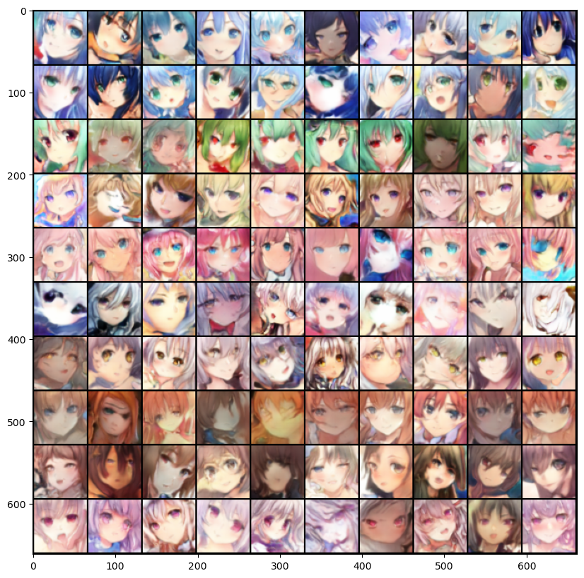
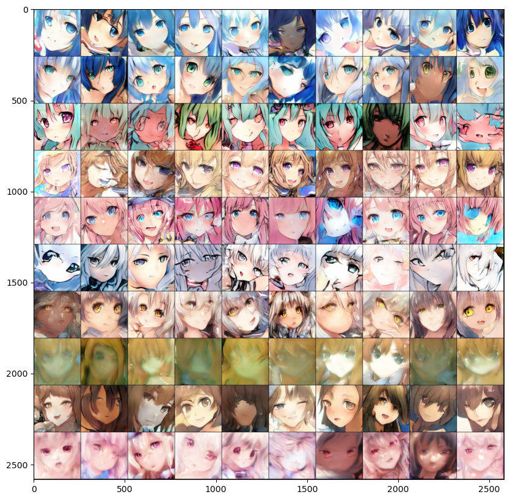
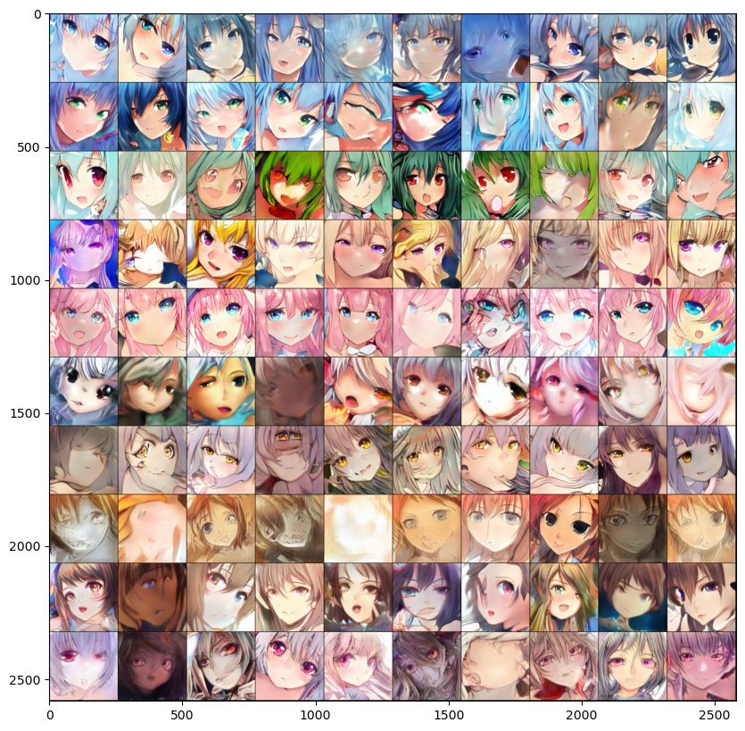

## Conditional GAN(Generative Adversarial Network)
The GAN model can generate images through noise. This project will control some of the factors input into the GAN, 
and by inputting text, it will impose some restrictions on the generated images (conditional GAN), achieving a simple text-to-image.
 
Anime Face is used, and the text conditions for input include hair color and eye color.

### Data Preparation
spider_crop.ipynb
 
* Data Crawling: Web crawling through the API provided by the image library website, grab the content of json,
  select images that meet the conditions (such as: hair color, eye color tag only has one set), and read the image.

* Face Cropping: [lbpcascade_animeface](https://github.com/nagadomi/lbpcascade_animeface) Use the anime face detection xml provided by lbpcascade_animeface
  to extract the facial part of the image (since this xml was created in 2011, it may generate some extraction errors
  for the evolved painting style, light and shadow or coloring method, this project did not manually eliminate this problem)
  
* Obtained about 38,000 256x256 images, the range of tags grabbed includes 12 hair colors and 11 eye colors, and their distribution can be seen in the chart below
  ("more than single" means that the image has more than one hair color or eye color tag, this kind of image is not within the scope of grabbing, so the number is 0.
  "no information" means that the image lacks hair color or eye color tag, as long as there is one type of tag, it will be grabbed)
  

### GAN Model Architecture
The StackGan form is adopted. Refer to the original author:[StackGAN](https://github.com/hanzhanggit/StackGAN-Pytorch)和[StackGAN++](https://github.com/hanzhanggit/StackGAN-v2)
 
Architecture is shown below:

1. The dataset provides 64x64 and 256x256 real images, along with hair tags and eye tags. The tag part input into the stage 1 Generator,
   and it is synthesized with the n-dimensional normal distribution random noise to generate a 64x64 fake image.
2. The 64x64 fake image and 64x64 real image will be input into the stage 1 Discriminator. Although it is not indicated on the figure,
   in order to distinguish between the realistic and conditional evaluation results, we will also input a fake tag that is different from the real tag.
    * The formation of the fake tag is to randomly select one from the positions originally 0 in the one-hot real tag and change it to 1
      (equivalent to indicating a color that does not match the real picture).
      However, if it was originally all 0 (no color information, because it may lack one type of tag), it remains unchanged.
    * Therefore, we will compare three types: real image with real tag (realistic=1, conditional=1), fake image with real tag (realistic=0, conditional=0),
      and real image with fake tag (realistic=1, conditional=0).
3. The information generated by the stage 1 Generator and the tag part are input into the stage 2 Generator to generate a 256x256 fake image.
4. The 256x256 real and fake images are input into the stage 2 Discriminator,
   and the realistic and conditional evaluation results are obtained in the same way as the stage 1 Discriminator.

### Training process and testing (with fixed input noise)
1. Training stage 1 with 300 epochs
   

 
2. Fix stage 1 parameters, training stage 2 with 50 epochs

 
3. Training whole model with 100 epochs

 
Results after three stages, the first stage can generate a 64x64 face. In the second stage, it becomes 256x256, you can see that the face is not so stable,
but the model enhances the lines and light and shadow while improving the resolution.
In the third stage, you can see that many faces are more stable and clear than before.

 
In these 100 pictures, we gave 1 set of tags for each row. The generation results of rows 6~10 may be slightly worse compared to the first 5 rows. 
The possible reasons could be:

* The amount of data for that hair color or eye color is not enough to allow the Generator to generate stably.
  The model cannot guarantee that all random noise will be converted into an “obvious” face. The lack of data for the color may exacerbate the situation.
* Providing only one type of information, either hair color or eye color (in rows 6, 7, 9, 10), may cause the Generator to generate pictures in a larger field,
  and the variation may also increase. 
 

### Presentation on the Web
The stage 1 Generator model is stored in a Docker Image, and a simple web template is used to present the selection of hair color and eye color 
for image generating.( [Github link](https://github.com/ChuanYenWu/Doc_fls "Link") )
