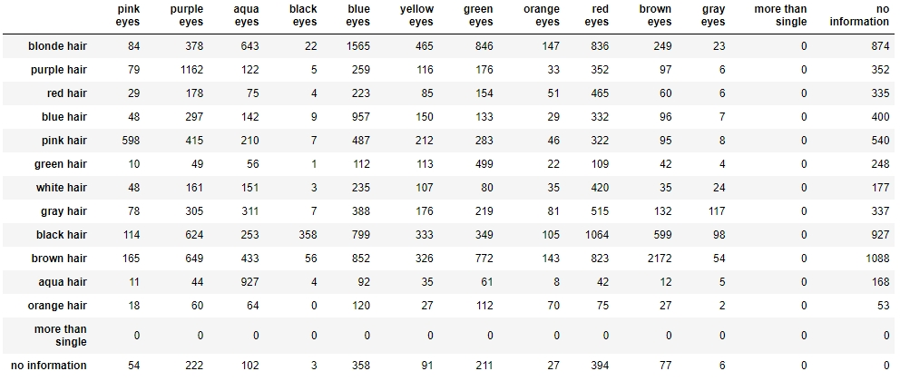
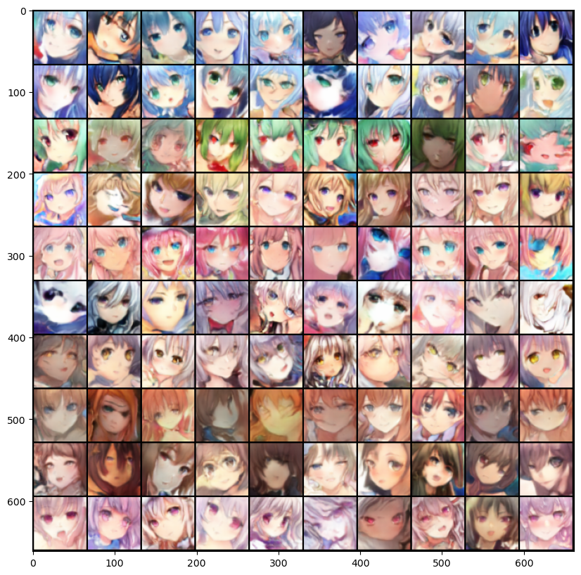
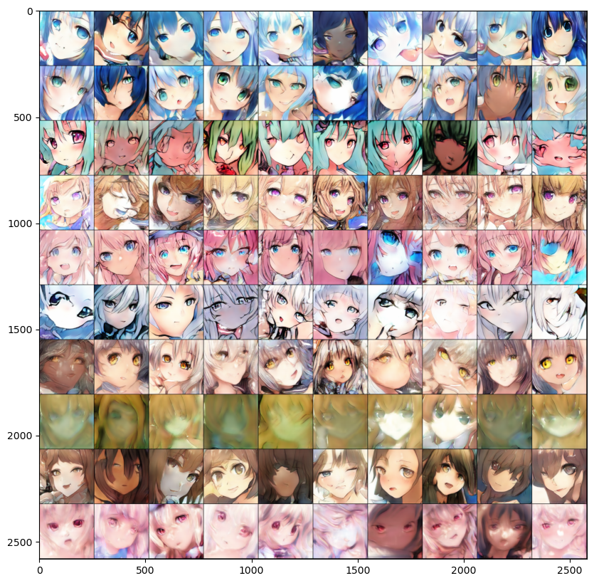
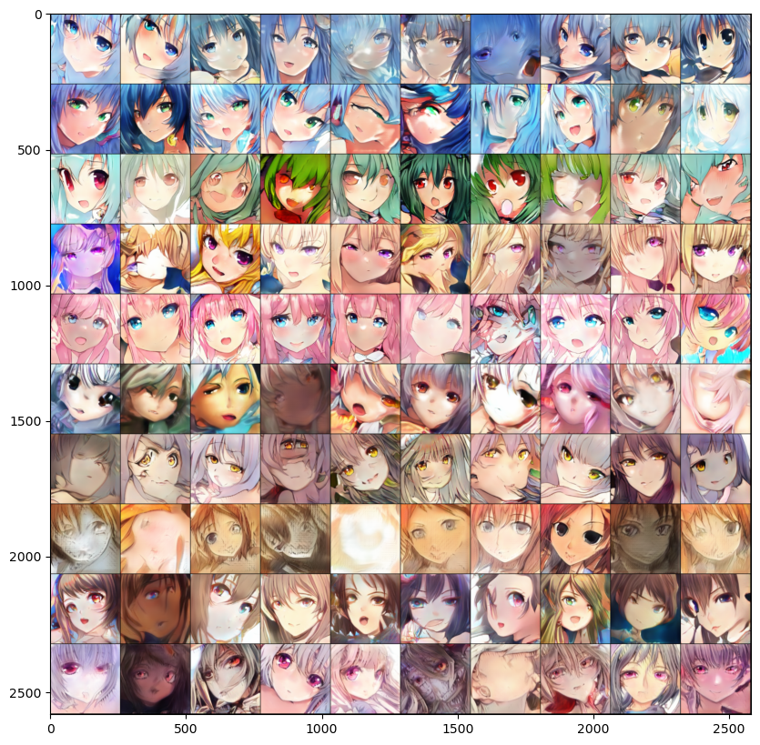

"# conditional_gan" 
spider_crop
stackgan_stage1, stage2, stagewhole
stackgan_util
test

## Conditional GAN(Generative Adversarial Network)
GAN模型能夠透過noise產生圖片，此project將控制部分輸入GAN的變因，透過輸入文字給予生成圖片一些限制(conditional GAN)，達成簡單的text-to-image。
 
採用動漫人物人臉(Anime Face)，輸入的文字條件包含髮色、瞳色(hair, eyes)

### 資料準備
spider_crop.ipynb
 
* 資料抓取: 透過圖庫網站提供的API。進行網路爬蟲，抓取json內容，選出符合條件的圖片(如:髮色、瞳色tag只有一組)，讀取圖片
* 臉部切割: [lbpcascade_animeface](https://github.com/nagadomi/lbpcascade_animeface)所提供的動漫臉部偵測xml來擷取出圖片中的臉部部分(由於此xml是2011年作成，針對後來演變的畫風、光影或上色方式，可能會有些擷取錯誤的產生，此project沒有進行人工剔除)
* 取得256x256圖片約3萬8千張，抓取的tag範圍有12種髮色和11種瞳色，其分布可見下方圖表(more than single表示該圖有超過一種的髮色或瞳色tag，此種圖不在抓取範圍內，因此數量為0；no information表示該圖缺少髮色或瞳色tag，只要有其中一類tag就會抓取)

### GAN模型架構
採用StackGan層層放大圖像的形式，可參考原作者:[StackGAN](https://github.com/hanzhanggit/StackGAN-Pytorch)和[StackGAN++](https://github.com/hanzhanggit/StackGAN-v2)。
 
架構如圖示:

1. Dataset給予64x64和256x256的real image以及hair tag和eyes tag，將tag部分輸入stage 1 Generator，與n維的normal distribution random noise一起合成產生64x64的假圖片fake image。
2. 64x64 fake image和64x64 real image將輸入stage 1 Discriminator，另外圖上雖沒有標示，但我們為了區分出realistic 和conditional 兩種評估結果，我們還會輸入與真實tag不同的fake tag。
    * fake tag的形成方式為在one-hot真實tag中原先為0的位置中隨機取一個變成1(相當於標示一個與真實圖片不相符的顏色)，但若原先就都是0(沒有顏色資訊，因為可能缺少其中一類的tag)則維持不變。
    * 因此我們會比較3種類型，real image與真實tag(realistic=1, conditional=1)、fake image與真實tag(realistic=0, conditional=0)、real image與fake tag(realistic=1, conditional=0)
3. 將stage 1 Generator產生的資訊與tag部分輸入stage 2 Generator，合成產生256x256的假圖片。
4. 256x256的真假圖片輸入stage 2 Discriminator，與stage 1 Discriminator相同的方法取得realistic 和conditional 兩種評估結果。

### 訓練流程及測試照片(固定輸入的noise)
1.只訓練stage 1 共300 epochs

 
2.固定stage 1參數，只訓練stage2 共50 epochs

 
3.完整訓練100 epochs 

 
能看到3階段下來，第一階段能產生64x64的人臉；第二階段變成256x256的情況，能看到人臉沒這麼穩定，但模型提升解析度的同時加強了線條和光影；第三階段能看到許多人臉比先前更穩定清晰了。
 
此100張圖中，每一行我們給了1組tag，6~10行跟前5行相比生成結果可能略差，其原因可能有:
* 該種髮色或瞳色資料量還不足以讓Generator穩定生成，模型本就無法保證將所有random noise都轉為"明顯"的人臉，資料不足的顏色可能使情況加劇。
* 只給予髮色或瞳色其中一類的資訊(6,7,9,10行)，可能會導致Generator在更大的field中去生成圖片，變異的程度也會增加。
